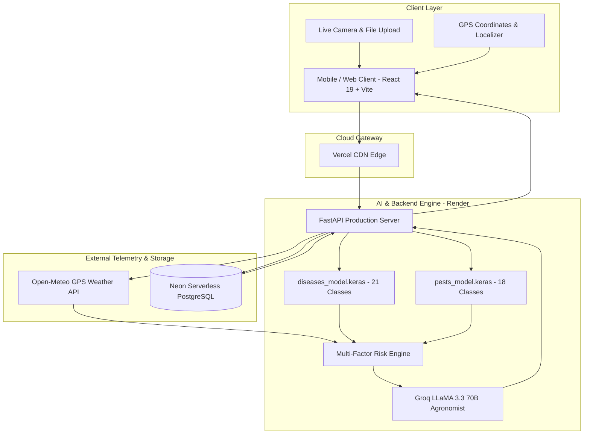

# 🌾 KrishiDrishti AI | Smart Crop Intelligence & Precision Agronomy

[](https://fastapi.tiangolo.com/)
[](https://react.dev/)
[](https://www.typescriptlang.org/)
[](https://www.tensorflow.org/)
[](https://groq.com/)
[](https://neon.tech/)
[](https://tailwindcss.com/)

> **Team Agri-NEX — Smart India Hackathon (SIH 2026)**  
> An enterprise-grade agricultural diagnostics and field intelligence platform fusing **deep learning computer vision**, **real-time environmental telemetry**, **predictive risk engines**, and **generative AI agronomists** to protect crop yields and empower farmers.

---

## 📌 Problem Statement & Solution

Traditional farming suffers from delayed disease diagnosis, over-application of pesticides, and lack of localized agronomic guidance. **KrishiDrishti AI** addresses this through:

1. **Instant Vision Diagnosis**: Identifies 21 crop diseases and 18 insect pests in seconds using field-trained Keras neural networks.
2. **Context-Aware Risk Modeling**: Correlates visual symptoms with live GPS weather telemetry (temperature, humidity, rain forecast) and soil dynamics.
3. **AI Agronomist Advisory**: Delivers multilingual biological, chemical, and cultural remedies powered by Groq LLaMA 3.3 70B.
4. **Persistent History & Surveillance**: Cloud-backed historical tracking with Neon PostgreSQL to monitor outbreak patterns over time.

---

## 🏛️ System Architecture



---

## ✨ Key Features

### 🔍 1. Dual-Model Neural Vision Pipeline
- **Plant Pathology Engine (`diseases_model.keras`)**: Detects bacterial blights, rusts (yellow, brown, black), blasts, downy mildews, and smuts across Cotton, Rice, Wheat, and Millet.
- **Entomology Engine (`pests_model.keras`)**: Identifies pink bollworms, american bollworms, armyworms, aphids, and beetles.
- **Scientific Nomenclature**: Maps detections to verified scientific pathogens (e.g., *Xanthomonas oryzae*, *Helicoverpa armigera*).

### 🌦️ 2. Real-Time Telemetry & Risk Engine
- Live hyper-local weather ingestion (temperature, relative humidity, wind speed, precipitation probability).
- Generates optimal chemical spraying windows (e.g., alerts to postpone sprays prior to rain events to prevent chemical runoff).
- Evaluates fungal incubation risk based on prolonged high humidity.

### 🧠 3. Conversational AI Agronomist
- Powered by **Groq LLaMA 3.3 70B** with streaming chat consultations.
- Context-injected reasoning combining visual detections, crop stage, farmer observations, and weather conditions.
- **Multilingual Support**: English, Hindi (हिंदी), Marathi (मराठी), and more.

### 📊 4. Interactive Farmer Dashboard
- Live camera diagnosis modal with framing guides.
- Drag-and-drop batch leaf analyzer.
- Comprehensive diagnostic report export (PDF / JSON).
- Full historical scan audit trail backed by Neon PostgreSQL.

---

## 🛠️ Technology Stack

| Domain | Technology | Purpose |
| :--- | :--- | :--- |
| **Frontend** | React 19, TypeScript, Vite | Ultra-fast single page application |
| **Styling** | Tailwind CSS, Lucide Icons | Responsive, accessible modern UI |
| **Backend** | FastAPI, Uvicorn | High-concurrency async Python REST API |
| **Computer Vision** | TensorFlow / Keras, OpenCV | Deep neural network image inference |
| **LLM Reasoning** | Groq Cloud (LLaMA 3.3 70B) | Instant multilingual agronomy advisory |
| **Database** | Neon.tech (PostgreSQL) | Serverless relational cloud database |
| **Telemetry** | Open-Meteo API | Free GPS-based real-time weather feeds |
| **Deployment** | Vercel (Web), Render (API) | 100% Free tier cloud hosting |

---

## 📂 Project Structure

```text
SIH/
├── .gitignore                     # Production Git rules (protects secrets & node_modules)
├── DEPLOYMENT_GUIDE.txt           # Step-by-step 100% free cloud deployment manual
├── README.md                      # Project documentation
│
├── AgrineX_models/                # FastAPI Backend & AI Vision Pipeline
│   ├── .env                       # Local secrets (DATABASE_URL, GROQ_API_KEY)
│   ├── .env.example               # Backend configuration template
│   ├── api_server.py              # Main FastAPI production server & endpoints
│   ├── app.py                     # Hugging Face Gradio bridge (16 GB Free RAM)
│   ├── chat_agronomist.py         # Groq LLM advisory generator
│   ├── live_camera.py             # Standalone OpenCV webcam testing script
│   ├── requirements.txt           # Python production dependencies
│   ├── Dockerfile                 # Container specification
│   ├── model/                     # Deep learning model artifacts
│   │   ├── diseases_model.keras   # Trained foliar disease network (~29 MB)
│   │   ├── diseases_classes.json  # 21 disease class mappings
│   │   ├── pests_model.keras      # Trained pest classification network (~29 MB)
│   │   └── pests_classes.json     # 18 pest class mappings
│   └── services/                  # Backend modular business logic
│       ├── db_service.py          # SQLAlchemy PostgreSQL & SQLite database layer
│       ├── risk_engine.py         # Environmental disease risk algorithm
│       ├── weather_service.py     # Live weather telemetry integration
│       ├── soil_service.py        # Soil moisture & nutrient analysis
│       └── location_service.py    # Geocoding & GPS reverse lookup
│
└── frontend/                      # React 19 + TypeScript + Vite Dashboard
    ├── .env                       # Frontend environment configuration
    ├── .env.example               # Frontend configuration template
    ├── package.json               # Node dependencies and scripts
    ├── vite.config.ts             # Vite build configuration
    └── src/
        ├── components/            # Reusable UI components (Camera, Chat, Reports)
        ├── contexts/              # Global state (Auth, Location, Language)
        ├── pages/                 # Route views (Dashboard, Scan, History, Weather)
        ├── services/              # API clients & IndexedDB fallback engine
        └── types/                 # TypeScript data contracts & interfaces
```

---

## 🚀 Quickstart: Running Locally

### Prerequisites
- **Node.js**: v18+ installed
- **Python**: v3.10 or v3.11 installed
- **Groq API Key**: Obtain a free key from [console.groq.com](https://console.groq.com)

---

### 1. Start the Backend API Server

```bash
# Navigate to backend directory
cd AgrineX_models

# Create & activate virtual environment (Windows PowerShell)
python -m venv .venv
.\.venv\Scripts\Activate.ps1

# Install required Python packages
pip install -r requirements.txt

# (Optional) Set your keys in AgrineX_models/.env
# GROQ_API_KEY="gsk_..."
# DATABASE_URL="" (Leave empty for automatic local SQLite)

# Start the FastAPI server
python api_server.py
```
* Backend will be running at: **`http://localhost:8000`**
* Interactive Swagger Docs: **`http://localhost:8000/docs`**

---

### 2. Start the Frontend Application

Open a **second terminal**:

```bash
# Navigate to frontend directory
cd frontend

# Install node dependencies
npm install

# Start the Vite development server
npm run dev
```
* Web Dashboard will open at: **`http://localhost:5173`**

---

## ☁️ 100% Free Cloud Deployment

This project is pre-configured to run completely free without any credit card:

| Component | Host | Setup Details |
| :--- | :--- | :--- |
| **Database** | **[Neon.tech](https://neon.tech)** | Serverless PostgreSQL (0.5 GB free). Run the table schema SQL provided in [`DEPLOYMENT_GUIDE.txt`](DEPLOYMENT_GUIDE.txt). |
| **Backend API** | **[Render.com](https://render.com)** | Free Python Web Service. Set Root Directory to `AgrineX_models`, Build: `pip install -r requirements.txt`, Start: `uvicorn api_server:app --host 0.0.0.0 --port $PORT`. |
| **Frontend** | **[Vercel](https://vercel.com)** | Set Root Directory to `frontend`, Framework: Vite, Environment Variable: `VITE_API_BASE_URL=https://your-render-app.onrender.com/api`. |

*(For full step-by-step instructions, see **[`DEPLOYMENT_GUIDE.txt`](DEPLOYMENT_GUIDE.txt)**)*

---

## 🧪 Supported Classes & Pathogens

<details>
<summary><b>Click to expand 21 Supported Crop Diseases</b></summary>

| Crop | Disease / Condition | Scientific Pathogen Name |
| :--- | :--- | :--- |
| Cotton | Bacterial Blight | *Xanthomonas citri pv. malvacearum* |
| Cotton | Fusarium Wilt | *Fusarium oxysporum f. sp. vasinfectum* |
| Cotton | Verticillium Wilt | *Verticillium dahliae* |
| Cotton | Healthy | *Gossypium hirsutum (Healthy)* |
| Millet | Blast | *Magnaporthe grisea* |
| Millet | Downy Mildew | *Sclerospora graminicola* |
| Millet | Leaf Blight | *Bipolaris sorokiniana* |
| Millet | Smut | *Tolyposporium penicillariae* |
| Millet | Healthy | *Pennisetum glaucum (Healthy)* |
| Rice | Bacterial Blight | *Xanthomonas oryzae pv. oryzae* |
| Rice | Blast | *Magnaporthe oryzae* |
| Rice | Brown Spot | *Bipolaris oryzae* |
| Rice | False Smut | *Ustilaginoidea virens* |
| Rice | Healthy | *Oryza sativa (Healthy)* |
| Wheat | Yellow Rust | *Puccinia striiformis f. sp. tritici* |
| Wheat | Black Rust | *Puccinia graminis f. sp. tritici* |
| Wheat | Brown Rust | *Puccinia triticina* |
| Wheat | Leaf Blight | *Zymoseptoria tritici* |
| Wheat | Loose Smut | *Ustilago tritici* |
| Wheat | Powdery Mildew | *Blumeria graminis f. sp. tritici* |
| Wheat | Healthy | *Triticum aestivum (Healthy)* |

</details>

<details>
<summary><b>Click to expand 18 Supported Insect Pests</b></summary>

| Pest Name | Scientific Classification | Primary Crop Impact |
| :--- | :--- | :--- |
| Cotton Pink Bollworm | *Pectinophora gossypiella* | Cotton bolls & lint quality |
| American Bollworm | *Helicoverpa armigera* | Cotton, Pulses, Vegetables |
| Armyworm | *Spodoptera frugiperda* | Millets, Maize, Rice |
| Cotton Aphid | *Aphis gossypii* | Foliage & sap depletion |
| Flea Beetle | *Chrysomelidae / Phyllotreta* | Leaf perforations |
| Rice Stem Borer | *Scirpophaga incertulas* | Dead hearts in tillers |
| Brown Planthopper | *Nilaparvata lugens* | Hopper burn in paddy fields |
| Whitefly | *Bemisia tabaci* | Vector for leaf curl virus |

</details>

---

## 👥 Team Agri-NEX (SIH 2026)

Developed with dedication for the **Smart India Hackathon (SIH 2026)** to bring cutting-edge AI technology straight to the agricultural grassroots.

- **Organization:** [SIH-2026-Team-Agrinex](https://github.com/SIH-2026-Team-Agrinex)
- **Repository:** [KrishiDrishti](https://github.com/SIH-2026-Team-Agrinex/KrishiDrishti)

---

## 📄 Open Source Declaration & Usage
This project was developed by Team Agrinex for the **Smart India Hackathon 2026**. 

We built **Krishi Drishti** with the core mission of democratizing agricultural technology. As such, the source code is made publicly available to encourage further innovation in the Ag-Tech sector. 

Developers, researchers, and NGOs are welcome to study, adapt, and build upon this prototype for the purposes of agricultural research and farmer empowerment.
